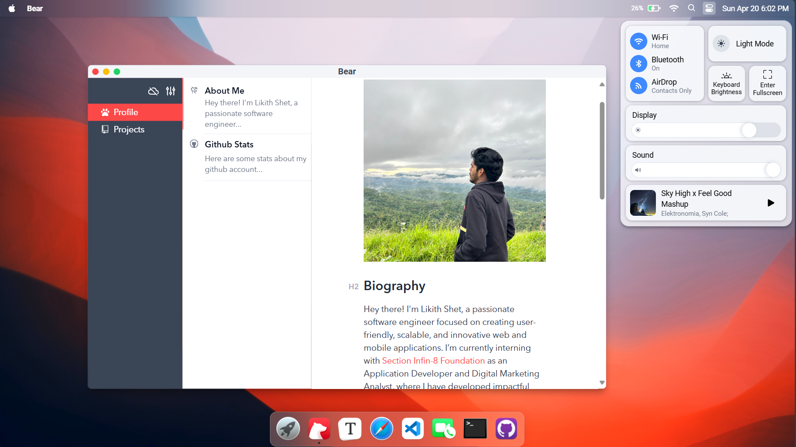
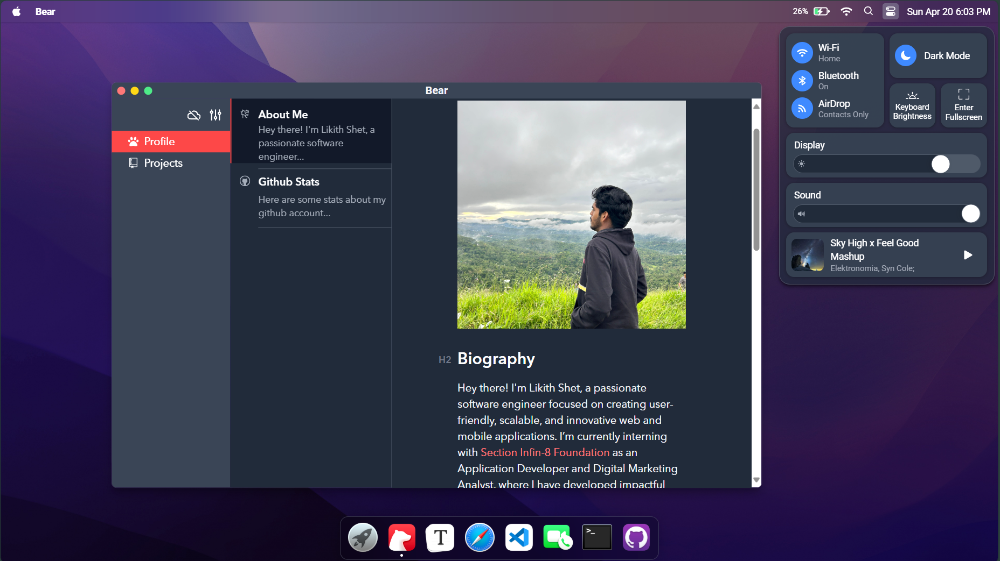

# playground-macos

My portfolio website simulating macOS's GUI: 

Powered by [React](https://reactjs.org/) + [Zustand](https://zustand-demo.pmnd.rs/) + [UnoCSS](https://uno.antfu.me/) + [TypeScript](https://www.typescriptlang.org/) + [Vite](https://vitejs.dev/).





&nbsp;

## Usage

Clone the repo and install dependencies:

```bash
pnpm install
```

Start dev server (with hot reloading):

```bash
pnpm dev
```

Build for production with minification to the `dist` folder:

```bash
pnpm build
```


&nbsp;


&nbsp;

## Credits

- macOS
  - [Monterey](https://www.apple.com/macos/monterey/)
  - [Catalina](https://www.apple.com/bw/macos/catalina/)
- [macOS Icon Gallery](https://www.macosicongallery.com/)
- [sindresorhus/file-icon-cli](https://github.com/sindresorhus/file-icon-cli)
- [vivek9patel.github.io](https://github.com/vivek9patel/vivek9patel.github.io)


&nbsp;

## License

[MIT](MIT)
